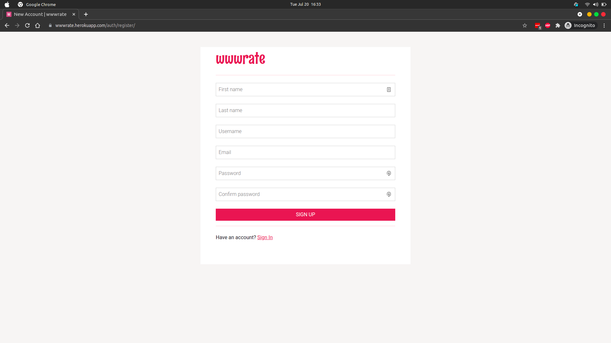
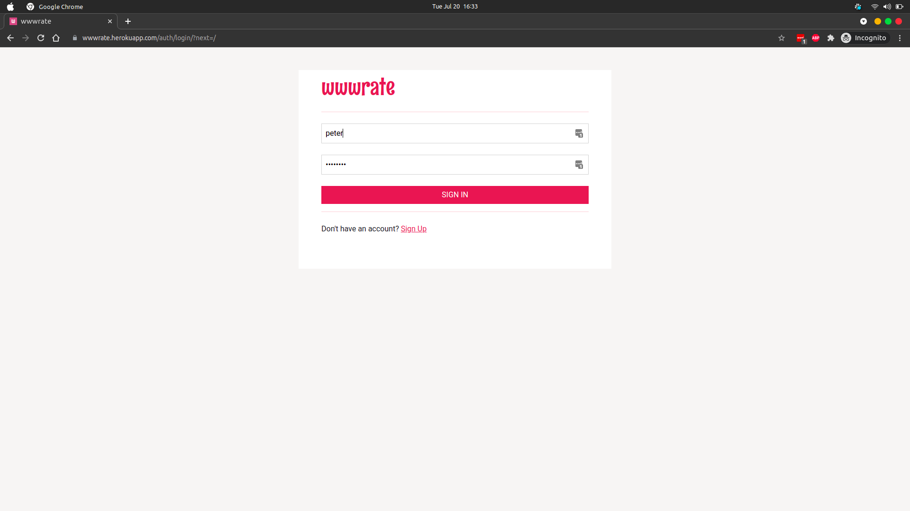
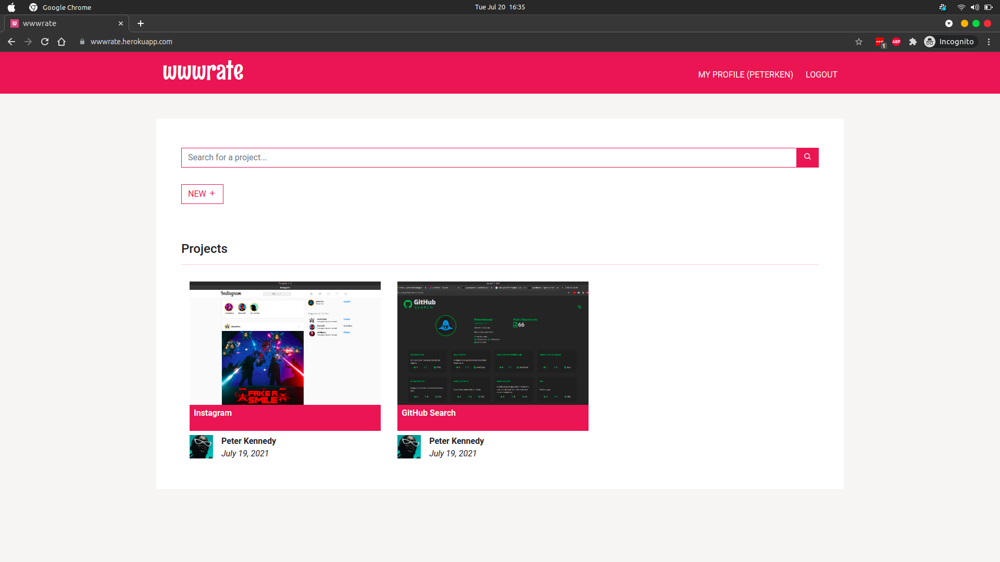
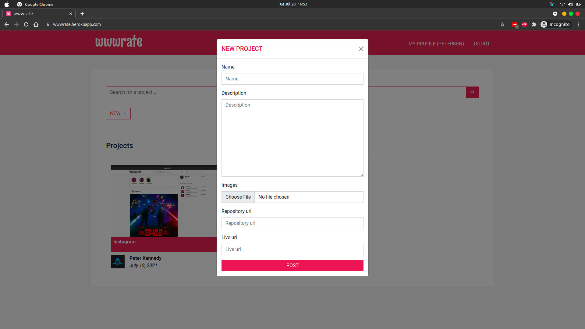
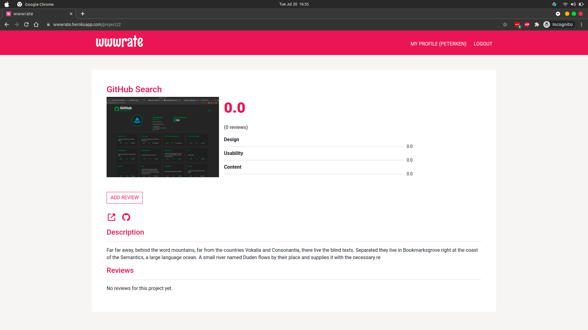
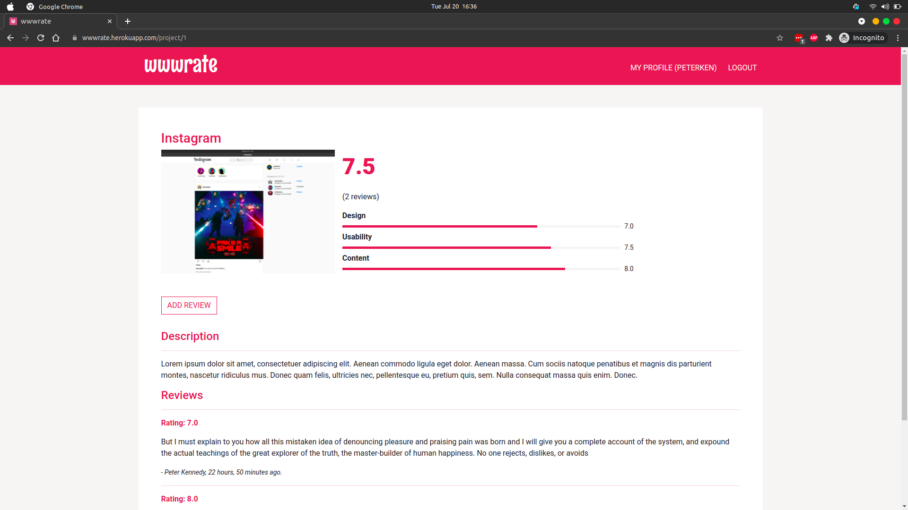
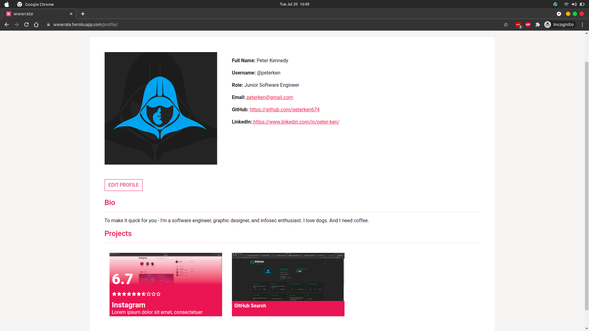
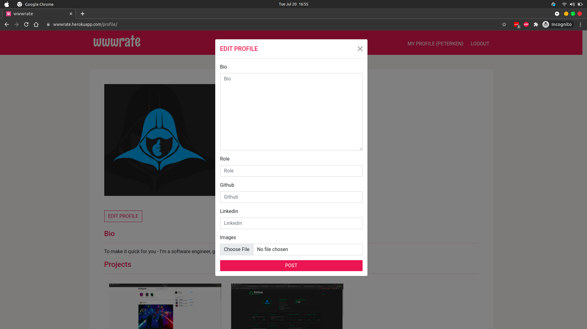

# Wwwrate
## Description
This site imitates the functionality of Awwward. Made with Django.
#



### **Registration page.**
#



### **Login page.**
#



### **Home page.**
#



### **New post view.**
#



### **Unrated project view.**
#



### **Rated project view.**
#



### **Profile view.**
#



### **Edit profile.**
#

 


## Setup/Installation
On your terminal, clone the project.
    
    $ git clone git@github.com:peterken674/wwwrate.git

Navigate into the cloned project.

    $ cd wwwrate

Create a `.env` file.

    $ touch .env

Inside `.env`, add the following and fill the empty fields with the appropriate values:

```python
SECRET_KEY=
DEBUG=True
DB_NAME=
DB_USER=
DB_PASSWORD=
DB_HOST='127.0.0.1'
MODE='dev'
ALLOWED_HOSTS='.localhost','.herokuapp.com','127.0.0.1'
DISABLE_COLLECTSTATIC=1
CLOUD_NAME= 
API_KEY=
API_SECRET=
```
The CLOUD_NAME, API_KEY, and the API_SECRET are from your account on [Cloudinary](https://cloudinary.com/).

Create the virtual environment and install the requirements from `requirements.txt`

    $ python3 -m venv env
    $ . env/bin/activate
    $ pip install -r requirements.txt


Perform a migration.

    $ python3 manage.py migrate


Start the server to run locally.

    $ python3 manage.py runserver

## API Endpoints
This site has 2 endpoints; 
    
- **Profiles:** [https://wwwrate.herokuapp.com/api/profiles/](https://wwwrate.herokuapp.com/api/profiles/)

    - This is used to query the profiles stored in the database.
- **Projects:** [https://wwwrate.herokuapp.com/api/projects/](https://wwwrate.herokuapp.com/api/projects/)

    - This is used to query data about the projects stored in the database.

## Known Bugs
No known bugs.
## Technologies Used
- Django
- Python 3.8.5
- Vanilla Javascript
- Bootstrap 5
- Postgresql
- Unittest
- Cloudinary
- Heroku
## Support and contact details
If you have any suggestions, questions or in case of a fire, you can reach the developer via [email](mailto:peterken.ngugi@gmail.com).
### License
 [](LICENSE)

Copyright &copy; 2021 **[peterken674](www.github.com/peterken674)**